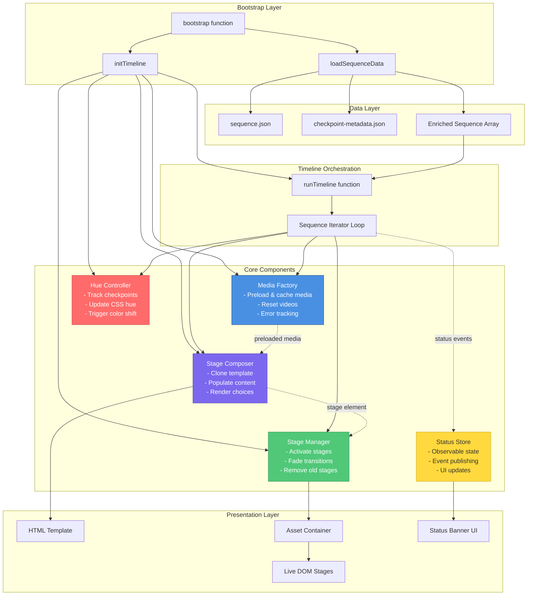
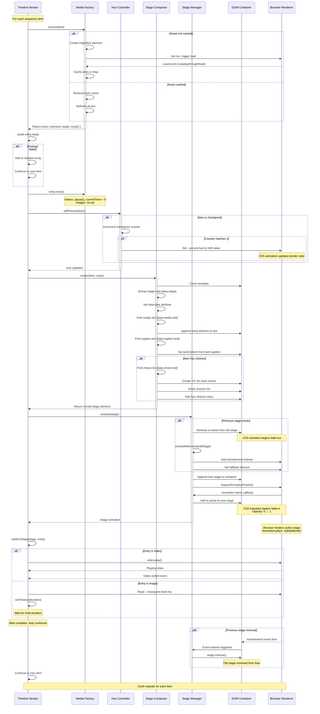

# Guided Meditation Architecture Diagrams

This document provides comprehensive Mermaid diagrams visualizing the architecture of the guided meditation experience.

## 1. Component Interaction

This diagram shows how the main components work together to orchestrate the meditation experience.



## 2. Data Flow

This diagram traces how data flows from JSON files through the application to the rendered DOM.

```mermaid
flowchart TD
    Start([Application Start]) --> FetchSequence[Fetch sequence.json]
    Start --> FetchMetadata[Fetch checkpoint-metadata.json]

    FetchSequence --> SequenceArray[Sequence Array<br/>checkpoint/transition items]
    FetchMetadata --> MetadataArray[Metadata Array<br/>enrichment data]

    SequenceArray --> CreateLookup[Create Metadata Lookup Map<br/>filename → metadata]
    MetadataArray --> CreateLookup

    CreateLookup --> EnrichSequence[Enrich Sequence<br/>Merge metadata into items]

    EnrichSequence --> EnrichedItems[Enriched Sequence Items<br/>item + metadata]

    EnrichedItems --> TimelineLoop{For Each Item}

    TimelineLoop --> BuildAssetURL[Build Asset URL<br/>/assets/...]
    BuildAssetURL --> InferKind{Infer Media Kind}

    InferKind -->|transition or .mp4| CreateVideo[Create Video Element<br/>muted, playsinline, preload]
    InferKind -->|checkpoint or image| CreateImage[Create Image Element<br/>async decoding, alt text]

    CreateVideo --> PreloadVideo[Preload Video<br/>canplaythrough event]
    CreateImage --> PreloadImage[Preload Image<br/>load event]

    PreloadVideo --> CacheEntry[Cache in Media Factory<br/>asset path → entry]
    PreloadImage --> CacheEntry

    CacheEntry --> ExtractAltText[Extract Alt Text<br/>metadata.description || title || caption]
    ExtractAltText --> CloneTemplate[Clone Stage Template<br/>HTML fragment]

    CloneTemplate --> PopulateStage[Populate Stage<br/>- Insert media element<br/>- Set caption text<br/>- Render choices list<br/>- Set data attributes]

    PopulateStage --> UpdateHue[Update Hue Controller<br/>Check if checkpoint #2]
    UpdateHue --> ActivateStage[Activate Stage<br/>Append to container<br/>Add is-active class]

    ActivateStage --> WaitForMedia{Media Type?}
    WaitForMedia -->|video| PlayVideo[Play Video<br/>await ended event]
    WaitForMedia -->|image| HoldCheckpoint[Hold for Duration<br/>read --checkpoint-hold-ms]

    PlayVideo --> FadeOut[Fade Out Previous Stage<br/>Remove is-active class]
    HoldCheckpoint --> FadeOut

    FadeOut --> RemovePrevious[Schedule Removal<br/>After transition duration]
    RemovePrevious --> TimelineLoop

    TimelineLoop -->|Done| Complete([Experience Complete])

    style SequenceArray fill:#e1f5ff,stroke:#4a90e2
    style MetadataArray fill:#fff4e1,stroke:#ffa726
    style EnrichedItems fill:#e8f5e9,stroke:#66bb6a
    style CacheEntry fill:#f3e5f5,stroke:#ab47bc
    style PopulateStage fill:#fff9c4,stroke:#ffd54f
    style ActivateStage fill:#ffebee,stroke:#ef5350
```

## 3. State Management

This diagram illustrates how sequence items flow through the timeline iterator and how state transitions occur.

```mermaid
stateDiagram-v2
    [*] --> LoadingData: bootstrap()

    LoadingData --> EnrichingSequence: JSON loaded
    EnrichingSequence --> ReadyToIterate: Metadata merged

    ReadyToIterate --> IteratingSequence: runTimeline()

    state IteratingSequence {
        [*] --> FetchingNextItem

        FetchingNextItem --> CheckingCache: Get item from sequence

        CheckingCache --> CacheHit: Asset cached
        CheckingCache --> CacheMiss: Asset not cached

        CacheMiss --> CreatingMediaEntry: mediaFactory.ensure()
        CreatingMediaEntry --> Preloading: Create img/video element

        Preloading --> PreloadSuccess: Load event
        Preloading --> PreloadError: Error event

        PreloadError --> SkippedAsset: Track in skipped array
        SkippedAsset --> FetchingNextItem

        CacheHit --> RefreshingAltText: Update alt attribute
        PreloadSuccess --> CachingEntry: Store in Map
        CachingEntry --> RefreshingAltText

        RefreshingAltText --> ResettingMedia: entry.reset()
        ResettingMedia --> NotifyingHueController: hueController.willPresent()

        state NotifyingHueController {
            [*] --> CheckType
            CheckType --> IsCheckpoint: type === checkpoint
            CheckType --> IsTransition: type === transition
            IsTransition --> [*]
            IsCheckpoint --> IncrementCounter
            IncrementCounter --> CheckCount
            CheckCount --> Count0: count = 1
            CheckCount --> Count1: count = 2
            CheckCount --> CountOther: count > 2
            Count0 --> [*]
            Count1 --> FlipToShiftHue
            CountOther --> [*]
            FlipToShiftHue --> UpdateCSSVariable
            UpdateCSSVariable --> [*]
        }

        NotifyingHueController --> ComposingStage: stageComposer.render()

        state ComposingStage {
            [*] --> CloneTemplate
            CloneTemplate --> SetDataAttributes
            SetDataAttributes --> InsertMediaElement
            InsertMediaElement --> PopulateCaptionText
            PopulateCaptionText --> CheckChoices
            CheckChoices --> HasChoices: choices array exists
            CheckChoices --> NoChoices: no choices
            HasChoices --> RenderChoicesList
            RenderChoicesList --> [*]
            NoChoices --> [*]
        }

        ComposingStage --> ActivatingStage: stageManager.activate()

        state ActivatingStage {
            [*] --> FadingOutPrevious
            FadingOutPrevious --> RemovingPreviousClass: Remove is-active
            RemovingPreviousClass --> AppendingNewStage
            AppendingNewStage --> AddingActiveClass: Add is-active
            AddingActiveClass --> TriggeringTransition: requestAnimationFrame
            TriggeringTransition --> ScheduleRemoval: transitionend listener
            ScheduleRemoval --> [*]
        }

        ActivatingStage --> WaitingForStage: waitForStage()

        state WaitingForStage {
            [*] --> DetermineWaitType
            DetermineWaitType --> VideoWait: entry.type === video
            DetermineWaitType --> ImageWait: entry.type === image

            VideoWait --> PlayingVideo: video.play()
            PlayingVideo --> AwaitingEnded: ended listener
            AwaitingEnded --> [*]

            ImageWait --> ReadingCSSVariable: --checkpoint-hold-ms
            ReadingCSSVariable --> StartingTimeout: setTimeout()
            StartingTimeout --> AwaitingTimeout
            AwaitingTimeout --> [*]
        }

        WaitingForStage --> PresentedComplete
        PresentedComplete --> FetchingNextItem: Next item
        PresentedComplete --> [*]: No more items
    }

    IteratingSequence --> CheckingResults: Timeline complete

    state CheckingResults {
        [*] --> CountPresented
        CountPresented --> AllSkipped: presentedCount === 0
        CountPresented --> SomeSkipped: skipped.length > 0
        CountPresented --> AllSuccess: skipped.length === 0

        AllSkipped --> ShowError
        SomeSkipped --> ShowWarning
        AllSuccess --> ClearStatus

        ShowError --> [*]
        ShowWarning --> [*]
        ClearStatus --> [*]
    }

    CheckingResults --> [*]
```



## 4. Stage Lifecycle

This diagram shows the complete lifecycle of a stage from creation through activation to removal.



## Architecture Summary

### Key Design Principles

1. **Separation of Concerns**: Each component has a single, well-defined responsibility
2. **Async/Generator Pattern**: Timeline uses async iteration for natural sequence flow
3. **Caching Strategy**: Media Factory caches elements to avoid redundant preloads
4. **Template-Based Rendering**: Stage Composer clones HTML templates for consistent structure
5. **CSS-Driven Timing**: JavaScript reads CSS custom properties for configuration
6. **Observable Pattern**: Status Store uses pub/sub for decoupled UI updates
7. **Graceful Degradation**: Skipped assets are tracked but don't halt the experience

### Component Responsibilities

| Component | Input | Output | Side Effects |
|-----------|-------|--------|--------------|
| **Media Factory** | Sequence item | Cached media entry | Creates/caches img/video elements |
| **Stage Composer** | Item + cached entry | Cloned stage element | None (pure rendering) |
| **Stage Manager** | Stage element | - | Manipulates DOM, manages transitions |
| **Hue Controller** | Sequence item | - | Updates CSS custom properties |
| **Status Store** | Event object | - | Notifies subscribers, updates banner |
| **Timeline Iterator** | Enriched sequence | Presentation stats | Orchestrates all components |

### Data Structures

**Sequence Item (enriched)**:
```javascript
{
  type: 'checkpoint' | 'transition',
  asset: 'path/to/file.ext',
  caption: 'Display text',
  choices?: ['Choice A', 'Choice B'],
  metadata: {
    filename: 'file.ext',
    title: 'Display Title',
    description: 'Alt text description'
  }
}
```

**Media Entry**:
```javascript
{
  type: 'video' | 'image',
  element: HTMLVideoElement | HTMLImageElement,
  error: Error | null,
  ready: Promise<Element>,
  reset: () => void
}
```

### Critical Paths

1. **Happy Path**: Load JSON → Enrich → Preload → Render → Activate → Wait → Next
2. **Error Path**: Load failure → Skip item → Track in skipped → Continue
3. **Hue Shift**: Checkpoint #2 → Trigger hue flip → Update CSS variable → Border animation updates
4. **Stage Transition**: New stage activate → Fade in new → Fade out old → Remove old after transition

### Performance Characteristics

- **Preloading**: Sequential (one at a time) to avoid network congestion
- **Caching**: Map-based lookup, O(1) retrieval
- **Template Cloning**: Deep clone with content population
- **CSS Transitions**: Hardware-accelerated opacity changes
- **Memory Management**: Old stages removed after fade completes
- **Error Handling**: Non-blocking, tracked separately

---

*Generated for the Guided Meditation project - Architecture visualization using Mermaid*
