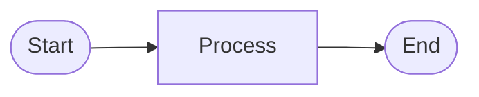

# Visualize Architecture

Generate comprehensive Mermaid diagrams from the chosen concept and validate the design.

## Purpose

After selecting a concept with requirements and specifications, create visual diagrams to represent the architecture. Generate multiple diagram types to show different views of the system, then validate for completeness and design gaps.

## Input

Read from previous skill:
- `explore-concepts-and-specs/CHOSEN.md` - Selected concept with requirements, specs, goals, features

## Process

1. **Generate Multiple Diagram Types**

   **Component Architecture:**
   - System components/modules
   - Relationships and dependencies
   - Data flow between components
   - Use: `graph TD` or `graph LR`

   **Data Flow Diagram:**
   - How data moves through the system
   - Transformations and processing steps
   - Input sources and output destinations
   - Use: `flowchart TD`

   **State Machine (if applicable):**
   - Application states
   - State transitions and triggers
   - Event handling
   - Use: `stateDiagram-v2`

   **Sequence Diagram (if applicable):**
   - Key user interactions
   - Component communication flows
   - Timing and ordering
   - Use: `sequenceDiagram`

   **Class/Type Diagram (if applicable):**
   - Main data structures
   - Type relationships
   - Key interfaces
   - Use: `classDiagram`

2. **Validate Design**
   - Check diagrams for completeness
   - Identify missing components or flows
   - Flag potential design conflicts
   - Verify alignment with requirements and specs

3. **Document Findings**
   - Diagram explanations
   - Design validation notes
   - Identified gaps or concerns
   - Recommendations

## Output Format

**DIAGRAMS.md** - All Mermaid diagrams with explanations:
````markdown
## Component Architecture


**Explanation:** [what this diagram shows]

---

## Data Flow


**Explanation:** [how data flows through system]

---

## State Machine


**Explanation:** [state transitions]
````

**VALIDATION.md** - Design validation results:
```markdown
## Design Validation

### Completeness Check
✅ All requirements covered in architecture
✅ All features have components
⚠️  [Any gaps identified]

### Design Conflicts
✅ No circular dependencies
✅ Clear data flow
⚠️  [Any issues found]

### Alignment with Specs
✅ Meets performance constraints
✅ Fits within technical boundaries
⚠️  [Any misalignments]

### Recommendations
- [suggestion 1]
- [suggestion 2]
```

**REPORT.md** - Summary for next skill

## Mermaid Syntax Reference

**Component/Architecture:**


**Data Flow:**


**State Machine:**


**Sequence:**


**Class/Type:**


## Notes

- This skill runs autonomously - no user prompts
- Generate 3-5 diagram types (choose most relevant for the concept)
- All diagrams should be valid Mermaid syntax
- Validation should be thorough but pragmatic
- Next skill (explore-implementation-options) will use these diagrams
